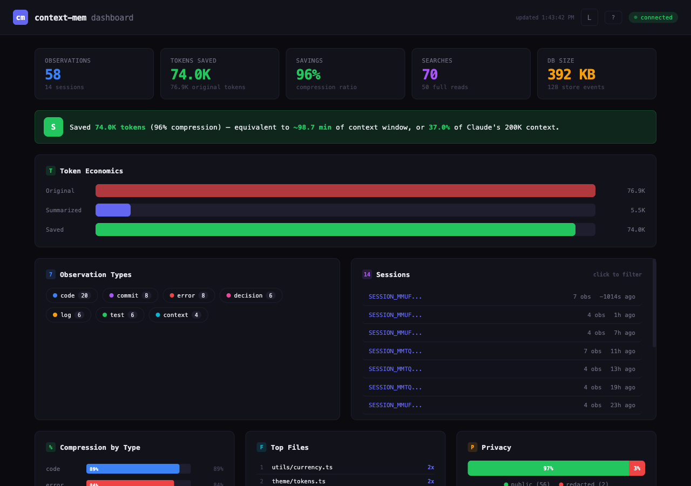
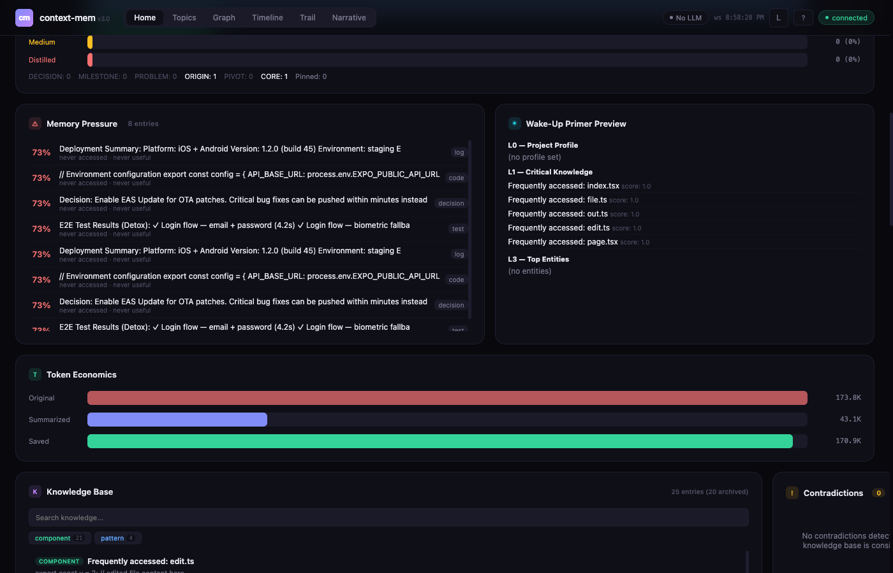

# context-mem

> Context optimization for AI coding assistants — 99% token savings, zero configuration, no LLM dependency.

[](https://www.npmjs.com/package/context-mem)
[]()
[](LICENSE)
[]()

AI coding assistants waste 60–80% of their context window on raw tool outputs — full npm logs, verbose test results, uncompressed JSON. This means shorter sessions, lost context, and repeated work.

**context-mem** captures tool outputs via hooks, compresses them using 14 content-aware summarizers, stores everything in local SQLite with full-text search, and serves compressed context back through the [MCP protocol](https://modelcontextprotocol.io). No LLM calls, no cloud, no cost.

## How It Compares

| | context-mem | claude-mem | context-mode | Context7 |
|---|---|---|---|---|
| **Approach** | 14 specialized summarizers | LLM-based compression | Sandbox + intent filter | External docs injection |
| **Token Savings** | 99% (benchmarked) | ~95% (claimed) | 98% (claimed) | N/A |
| **Search** | BM25 + Trigram + Fuzzy + **Vector** + reranking | Basic recall | BM25 + Trigram + Fuzzy | Doc lookup |
| **Semantic Search** | Local embeddings (free) + vector contradiction detection | LLM-based ($$$) | No | No |
| **Search Tuning** | Configurable BM25/Trigram/Levenshtein/Vector weights | No | No | No |
| **LLM Calls** | None (free, deterministic) | Every observation (~$57/mo) | None | None |
| **Activity Journal** | File edits, commands, reads | No | No | No |
| **Cross-Session Memory** | Journal + snapshots + DB | LLM summaries | Yes | No |
| **Knowledge Base** | 5 categories, auto-extraction, 14-day half-life decay, semantic contradiction detection, source tracking | No | No | No |
| **Background Agent** | Dreamer: auto-validates, marks stale (30d), archives (90d) | No | No | No |
| **Quick Profile** | Auto-generated project profile on session start | No | No | No |
| **Budget Management** | Configurable limits + overflow | No | Basic throttling | No |
| **Event Tracking** | P1–P4, error-fix detection | No | Session events only | No |
| **Dashboard** | Real-time web UI | Basic view | No | No |
| **Session Continuity** | Snapshot save/restore | Partial | Yes | No |
| **Content Types** | 14 specialized detectors | Generic LLM | Generic sandbox | Docs only |
| **Model Lock-in** | None (MCP protocol) | Claude-only | Claude-only | Any |
| **Privacy** | Fully local, tag stripping, 9 secret detectors, auto-redaction | Local | Local | Cloud |
| **Security** | CORS localhost-only, input validation, error sanitization | N/A | N/A | N/A |
| **License** | MIT | AGPL-3.0 | Elastic v2 | Open |

## Quick Start

```bash
cd your-project
npm i context-mem && npx context-mem init
```

One command. `init` auto-detects your editor and creates everything:

| Editor | What gets created | Restart needed? |
|--------|-------------------|-----------------|
| **Claude Code** | `.mcp.json` + `.claude/settings.local.json` (6 hooks) + CLAUDE.md rules | No |
| **Cursor** | `.cursor/mcp.json` + `.cursor/rules/context-mem.mdc` | No |
| **Windsurf** | `.windsurf/mcp.json` + `.windsurf/rules/context-mem.md` | No |
| **VS Code / Copilot** | `.vscode/mcp.json` + `.github/copilot-instructions.md` | No |
| **Cline** | `.cline/mcp_settings.json` + `.clinerules/context-mem.md` | No |
| **Roo Code** | `.roo-code/mcp_settings.json` + `.roo/rules/context-mem.md` | No |

**What init sets up:**
- MCP server config (so your editor can use context-mem's 32 tools)
- AI rules (so the AI knows when to call `observe`, `search`, `restore_session`)
- Claude Code hooks (activity journal, observation capture, proactive injection, session restore, dashboard)
- `.context-mem.json` config + `.context-mem/` data directory

**Verify it works** (in Claude Code):
```bash
cat .context-mem/journal.md | tail -5    # Should show recent tool activity
```

<details>
<summary>Manual setup (if init doesn't auto-detect your editor)</summary>

Create `.mcp.json` in your project root:
```json
{ "mcpServers": { "context-mem": { "command": "npx", "args": ["-y", "context-mem", "serve"] } } }
```

For VS Code / Copilot, use `.vscode/mcp.json`:
```json
{ "servers": { "context-mem": { "type": "stdio", "command": "npx", "args": ["-y", "context-mem", "serve"] } } }
```

For Goose, add to profile extensions:
```yaml
extensions:
  context-mem:
    type: stdio
    cmd: npx
    args: ["-y", "context-mem", "serve"]
```

For CrewAI / LangChain — see [configs/](configs/) for Python integration examples.

</details>

<details>
<summary>Alternative: Claude Code plugin mode (development)</summary>

```bash
claude --plugin-dir /path/to/context-mem
```

This loads hooks directly from the plugin directory. Useful for development and testing.

</details>

## Runtime Context Optimization (benchmark-verified)

| Mechanism | How it works | Savings |
|---|---|---|
| **Content summarizer** | Auto-detects 14 content types, produces statistical summaries | **97–100%** per output |
| **Index + Search** | FTS5 BM25 retrieval returns only relevant chunks, code preserved exactly | **80%** per search |
| **Smart truncation** | 4-tier fallback with 60/40 head/tail split for error preservation | **83–100%** per output |
| **Session snapshots** | Captures full session state in <8 KB | **~50%** vs log replay |
| **Budget enforcement** | Throttling at 80% prevents runaway token consumption | Prevents overflow |

**Result:** In a full coding session, **99% of tool output tokens are eliminated** — leaving 99.6% of your context window free for actual problem solving. See **[BENCHMARK.md](docs/benchmarks/results.md)** for complete results.

### Headline Numbers

| Scenario | Raw | Compressed | Savings |
|---|---|---|---|
| Full coding session (50 tools) | 365.5 KB | 3.2 KB | **99%** |
| 14 content types (555.9 KB) | 555.9 KB | 5.6 KB | **99%** |
| Index + Search (6 scenarios) | 38.9 KB | 8.0 KB | **80%** |
| BM25 search latency | — | 0.3ms avg | **3,342 ops/s** |
| Trigram search latency | — | 0.008ms avg | **120,122 ops/s** |

<sup>Verified on Apple M3 Pro, Node.js v22.22.0, 555.9 KB real-world test data across 21 scenarios.</sup>

## What Gets Compressed

14 summarizers detect content type automatically and apply the optimal compression:

| Content Type | Example | Strategy |
|---|---|---|
| Shell output | npm install, build logs | Command + exit code + error extraction |
| JSON | API responses, configs | Schema extraction (keys + types, no values) |
| Errors | Stack traces, crashes | Error type + message + top frames |
| Test results | Jest, Vitest | Pass/fail/skip counts + failure details |
| TypeScript errors | `error TS2345:` | Error count by file + top error codes |
| Build output | Webpack, Vite, Next.js | Routes + bundle sizes + warnings |
| Git log | Commits, diffs | Commit count + authors + date range |
| CSV/TSV | Data files, analytics | Row/column count + headers + aggregation |
| Markdown | Docs, READMEs | Heading tree + code blocks + links |
| HTML | Web pages | Title + nav + headings + forms |
| Network | HTTP logs, access logs | Method/status distribution |
| Code | Source files | Function/class signatures |
| Log files | App logs, access logs | Level distribution + error extraction |
| Binary | Images, compiled files | SHA256 hash + byte count |

## Features

**Search** — 4-layer hybrid: BM25 full-text → trigram fuzzy → Levenshtein typo-tolerant → optional vector/semantic search. Sub-millisecond latency with intent classification. Semantic search finds "auth problem" when stored as "login token expired" — local embeddings via all-MiniLM-L6-v2, no cloud, no cost. **Observation reranking** scores results by 70% relevance + 20% recency + 10% access frequency. **Request canonicalization** deduplicates similar queries with a 30-second cache. Search weights (BM25/Trigram/Levenshtein/Vector ratios) are fully configurable in `.context-mem.json`.

**Activity Journal** — Every file edit, bash command, and file read is logged to `.context-mem/journal.md` in human-readable format. Cross-session memory injects journal entries on startup — Claude knows exactly what changed in previous sessions without LLM calls.

**Plugin Commands** — `/context-mem:status` (stats + dashboard link), `/context-mem:search <query>` (search observations), `/context-mem:journal` (show activity log).

**Knowledge Base** — Save and search patterns, decisions, errors, APIs, components. **Knowledge entry decay** with 14-day half-life — explicit entries decay slower, access frequency boosts relevance, automatic archival. **Auto-extraction** — decisions, errors, commits, and frequently-accessed files are automatically saved to the knowledge base without manual intervention. **Semantic contradiction detection** — vector-based similarity (when `@huggingface/transformers` available) in addition to keyword overlap, automatically flags conflicting knowledge when saving new entries. **Source tracking** — records where each entry came from (manual, inferred, external).

**Quick Profile** — Generates a concise project profile from accumulated knowledge. Injected on session start so the AI assistant has immediate project context without searching.

**Dreamer Background Agent** — Runs automatically to maintain knowledge quality. Auto-validates knowledge entries, marks them stale after 30 days of no access, and archives after 90 days. Keeps the knowledge base fresh without manual intervention.

**Knowledge Graph** — Entity-relationship model that maps connections between project concepts, files, patterns, and decisions. Graph queries let you traverse relationships — find all entities related to a component, trace decision chains, or discover implicit connections across the codebase.

**Multi-Agent Shared Memory** — Built-in coordination for multi-agent workflows. Agents register with `agent_register`, claim files with `claim_files` to prevent edit conflicts, check who's working on what with `agent_status`, and broadcast messages to all active agents with `agent_broadcast`. Shared memory ensures agents don't duplicate work or create merge conflicts.

**Time-Travel Debugging** — View and compare project state at any point in time using `time_travel`. Inspect how knowledge, observations, and project context evolved across sessions — useful for understanding when a decision was made or tracking down when a regression was introduced.

**Natural Language Query** — Ask questions naturally with `ask` — intent classification routes your question to the right subsystem (search, knowledge, timeline, graph, or stats) without needing to know which tool to call.

**Auto-Promote** — Knowledge accessed in 3+ sessions is automatically promoted to the global cross-project store. No manual intervention needed — patterns that prove useful rise to the top.

**Cross-Project Merge** — Duplicate detection and auto-merge across projects. The `merge_suggestions` tool surfaces candidates for review. Conflict resolution handles contradictions gracefully.

**Project Health Score** — 0–100 composite metric visible in the dashboard. Color-coded gauge reflects knowledge freshness, contradiction rate, and activity.

**Confidence Scoring** — Every knowledge entry carries a confidence score based on source type, freshness, access frequency, and session count. Higher-confidence entries rank higher in search results.

**Auto-Tagger** — Deterministic title and tag generation from content. Reduces manual effort when saving knowledge entries.

**Ollama Integration** — Optional Ollama client for AI-assisted knowledge curation. When an Ollama endpoint is configured, it can help deduplicate, summarize, and categorize entries.

**Export/Import** — Transfer knowledge between machines: `context-mem export` dumps knowledge, snapshots, and events as JSON; `context-mem import` restores them in another project. Merge or replace modes.

**Budget Management** — Session token limits with three overflow strategies: aggressive truncation, warn, hard stop.

**Event Tracking** — P1–P4 priority events with automatic error→fix detection.

**Session Snapshots** — Save/restore session state across restarts with progressive trimming.

**Dashboard 2.0** — Real-time web UI at `http://localhost:51893` — auto-starts on session start via hooks. **Multi-project support** — one central dashboard shared across all active projects, with a project switcher bar. Token economics, observations, search, knowledge base, events, system health. **Knowledge graph visualization** — interactive force-directed canvas graph with pan/zoom/filter, color-coded by entity type. **Timeline explorer** — visual observation timeline with search, date filtering, and type pills. SSE streaming for live updates. Dark/light theme with persistence across pages.

<p align="center">
  
</p>
<p align="center">
  
</p>

**VS Code Extension** — Sidebar dashboard, status bar with live savings, command palette (start/stop/search/stats). Install from marketplace: `context-mem`.

**Auto-Detection** — `context-mem init` detects your editor (Cursor, Windsurf, VS Code, Cline, Roo Code) and creates MCP config, AI rules, and Claude Code hooks automatically.

**OpenClaw Native Plugin** — Full ContextEngine integration with lifecycle hooks (bootstrap, ingest, assemble, compact, afterTurn, dispose). See [openclaw-plugin/](openclaw-plugin/).

**Privacy Engine** — Everything local. `<private>` tag stripping, custom regex redaction, plus 9 built-in secret detectors: AWS keys, GitHub tokens, JWTs, private keys, Slack tokens, emails, IPs, generic API keys, and AWS secrets. Secrets are auto-redacted before storage. No telemetry, no cloud.

**Plugin CLI** — Manage summarizer plugins: `context-mem plugin add <name>`, `plugin remove <name>`, `plugin list`. Supports short names (e.g., `k8s` → `context-mem-summarizer-k8s`).

**Auto-Update Check** — Checks npm for newer versions on session start (gstack-style). Split TTL caching (1hr fresh / 12hr nagging), escalating snooze (24h → 48h → 7 days), configurable via `~/.context-mem/config.yaml`. Never blocks, always graceful.

**Security Hardening** — CORS restricted to localhost only, input validation on all 32 handlers, error sanitization (file paths + SQL keywords stripped). Windows compatibility for cross-platform deployments.

**Smart Truncation** — 60/40 head/tail split for better error preservation at end of output. 4-tier fallback: JSON schema → Pattern → Head/Tail → Binary hash.

## Architecture

```
Tool Output → Hook Capture → HTTP Bridge (:51894) → Pipeline → Summarizer (14 types) → SQLite + FTS5
                                    ↓                    ↓                                      ↓
                              ObserveQueue         SHA256 Dedup                    4-Layer Search + Reranking
                             (burst protection)          ↓                          (70% relevance + 20% recency
                                              60/40 Truncation                      + 10% access frequency)
                                                      ↓                                        ↓
                                    Privacy Engine (9 detectors)              Request Canonicalization (30s cache)
                                                      ↓                                        ↓
                                    Auto-Extract KB + Dreamer Agent         AI Assistant ← MCP Server (32 tools)
                                                                                               ↓
                                                                           Dashboard 2.0 ← SSE + WebSocket (real-time)
```

## MCP Tools

<details>
<summary>32 tools available via MCP protocol</summary>

| Tool | Description |
|---|---|
| `observe` | Store an observation with auto-summarization |
| `search` | Hybrid search across all observations |
| `get` | Retrieve full observation by ID |
| `timeline` | Reverse-chronological observation list |
| `stats` | Token economics for current session |
| `summarize` | Summarize content without storing |
| `configure` | Update runtime configuration |
| `execute` | Run code snippets (JS, TS, Python, Shell, Ruby, Go, Rust, PHP, Perl, R, Elixir) |
| `index_content` | Index content with code-aware chunking |
| `search_content` | Search indexed content chunks |
| `save_knowledge` | Save to knowledge base |
| `search_knowledge` | Search knowledge base |
| `budget_status` | Current budget usage |
| `budget_configure` | Set budget limits |
| `restore_session` | Restore session from snapshot |
| `emit_event` | Emit a context event |
| `query_events` | Query events with filters |
| `update_profile` | Generate or retrieve project profile |
| `promote_knowledge` | Promote project knowledge to global cross-project store |
| `global_search` | Search global cross-project knowledge store |
| `graph_query` | Query the knowledge graph for entities and relationships |
| `add_relationship` | Add a relationship between entities in the knowledge graph |
| `graph_neighbors` | Find neighboring entities connected to a given node |
| `time_travel` | View/compare project state at any point in time |
| `ask` | Natural language questions with intent classification |
| `agent_register` | Register as named agent for multi-agent coordination |
| `agent_status` | List active agents and their tasks |
| `claim_files` | Claim files to prevent conflicts between agents |
| `agent_broadcast` | Broadcast messages to all active agents |
| `handoff_session` | Hand off session context for continuity across sessions |
| `resolve_contradiction` | Resolve conflicting knowledge entries (supersede, merge, keep both, archive) |
| `merge_suggestions` | View cross-project duplicate suggestions for manual review and merge |

</details>

## CLI Commands

```bash
context-mem init                    # Initialize in current project
context-mem serve                   # Start MCP server (stdio)
context-mem status                  # Show database stats
context-mem doctor                  # Run health checks
context-mem dashboard               # Open web dashboard
context-mem export                  # Export knowledge, snapshots, events as JSON
context-mem import                  # Import data from JSON export file
context-mem plugin add <name>       # Install a summarizer plugin
context-mem plugin remove <name>    # Uninstall a summarizer plugin
context-mem plugin list             # Show installed plugins
```

## Configuration

<details>
<summary>.context-mem.json</summary>

```json
{
  "storage": "auto",
  "plugins": {
    "summarizers": ["shell", "json", "error", "log", "code"],
    "search": ["bm25", "trigram", "vector"],
    "runtimes": ["javascript", "python"]
  },
  "search_weights": {
    "bm25": 0.5,
    "trigram": 0.3,
    "levenshtein": 0.15,
    "vector": 0.05
  },
  "privacy": {
    "strip_tags": true,
    "redact_patterns": [],
    "disabled_detectors": []
  },
  "token_economics": true,
  "lifecycle": {
    "ttl_days": 30,
    "max_db_size_mb": 500,
    "max_observations": 50000,
    "cleanup_schedule": "on_startup",
    "preserve_types": ["decision", "commit"]
  },
  "port": 51893,
  "db_path": ".context-mem/store.db"
}
```

</details>

## Documentation

| Doc | Description |
|---|---|
| [Benchmark Results](docs/benchmarks/results.md) | Full benchmark suite — 21 scenarios, 7 parts |
| [Configuration Guide](.context-mem.json.example) | All config options with defaults |

## Platform Support

| Platform | MCP Config | AI Rules | Auto-Setup |
|---|---|---|---|
| **Claude Code** | [CLAUDE.md](configs/claude-code/) | Appends to CLAUDE.md | `init` + `serve` |
| **Cursor** | [mcp.json](configs/cursor/) | [.cursor/rules/context-mem.mdc](configs/cursor/context-mem.mdc) | `init` + `serve` |
| **Windsurf** | [mcp_config.json](configs/windsurf/) | [.windsurf/rules/context-mem.md](configs/windsurf/context-mem.md) | `init` + `serve` |
| **GitHub Copilot** | [mcp.json](configs/copilot/) | [.github/copilot-instructions.md](configs/copilot/copilot-instructions.md) | `init` + `serve` |
| **Cline** | [cline_mcp_settings.json](configs/cline/) | [.clinerules/context-mem.md](configs/cline/context-mem.md) | `init` + `serve` |
| **Roo Code** | [mcp_settings.json](configs/roo-code/) | [.roo/rules/context-mem.md](configs/roo-code/context-mem.md) | `init` + `serve` |
| **Gemini CLI** | [GEMINI.md](configs/gemini-cli/) | Appends to GEMINI.md | `init` + `serve` |
| **Antigravity** | [GEMINI.md](configs/antigravity/) | Appends to GEMINI.md | `serve` |
| **Goose** | [recipe.yaml](configs/goose/) | — | Manual |
| **OpenClaw** | [mcp_config.json](configs/openclaw/) | — | Manual |
| **CrewAI** | [example.py](configs/crewai/) | — | Manual |
| **LangChain** | [example.py](configs/langchain/) | — | Manual |

AI Rules teach the AI **when and how** to use context-mem tools automatically — calling `observe` after large outputs, `restore_session` on startup, `search` before re-reading files.

## Available On

- **npm** — `npm install context-mem && npx context-mem init`
- **VS Code Marketplace** — [Context Mem](https://marketplace.visualstudio.com/items?itemName=JubaKitiashvili.context-mem)
- **Claude Code Plugin** — `claude --plugin-dir /path/to/context-mem`

## License

MIT — use it however you want.

## Author

[Juba Kitiashvili](https://github.com/JubaKitiashvili)

---

<p align="center">
  <b>context-mem — 99% less noise, 100% more context</b><br/>
  <a href="https://github.com/JubaKitiashvili/context-mem">Star this repo</a> · <a href="https://github.com/JubaKitiashvili/context-mem/fork">Fork it</a> · <a href="https://github.com/JubaKitiashvili/context-mem/issues">Report an issue</a>
</p>
